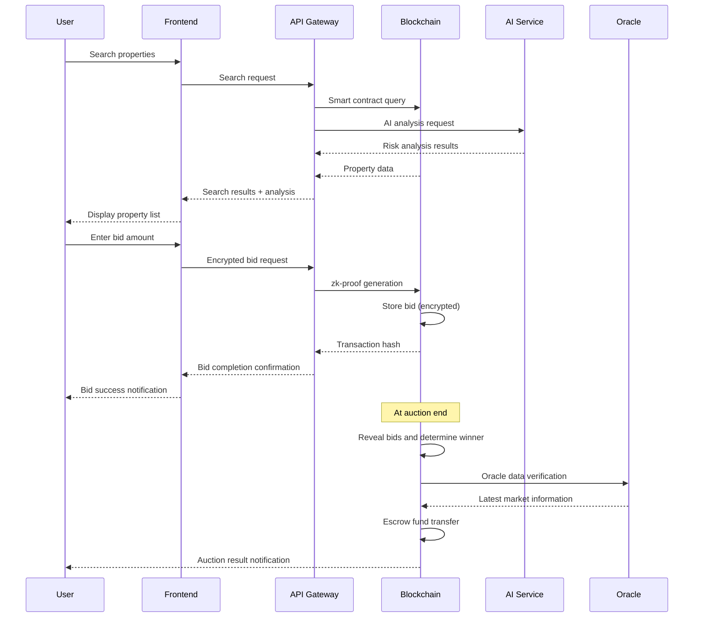

# EREA Technical Overview & Architecture
## 🔧 Avalanche EERC-Based Blockchain Real Estate Auction Platform

---

## 🏗️ System Architecture Overview

### High-Level Architecture
```
┌─────────────────────────────────────────────────────────────┐
│                    Frontend Layer                           │
│  React 18 + TypeScript + Vite + Tailwind CSS              │
└─────────────────────────────────────────────────────────────┘
                              │
┌─────────────────────────────────────────────────────────────┐
│                   API Gateway Layer                         │
│     RESTful APIs + GraphQL + WebSocket                     │
└─────────────────────────────────────────────────────────────┘
                              │
┌─────────────────────────────────────────────────────────────┐
│                  Business Logic Layer                       │
│   EERC SDK + AI Analytics + Oracle Integration             │
└─────────────────────────────────────────────────────────────┘
                              │
┌─────────────────────────────────────────────────────────────┐
│                   Blockchain Layer                          │
│        Avalanche Subnets + Smart Contracts                 │
└─────────────────────────────────────────────────────────────┘
                              │
┌─────────────────────────────────────────────────────────────┐
│                    Data Layer                               │
│    IPFS + Oracle Networks + Government APIs                │
└─────────────────────────────────────────────────────────────┘
```

---

## 🔐 EERC (Encrypted ERC) Core Technology

### EERC Protocol Structure
```solidity
// EERC Basic Interface
interface IEERC {
    // Store encrypted data
    function storeEncrypted(bytes32 dataHash, bytes calldata encryptedData) external;
    
    // Selective data disclosure
    function revealToAuthorized(bytes32 dataHash, address recipient) external;
    
    // Zero-knowledge proof verification
    function verifyZKProof(bytes calldata proof, bytes32 commitment) external returns (bool);
}
```

### Zero-Knowledge Proof Implementation
```javascript
// Bid privacy using zk-SNARKs
const bidCircuit = {
    inputs: {
        bidAmount: "private",      // Bid amount (private)
        minPrice: "public",       // Minimum price (public)
        maxBudget: "private"      // Maximum budget (private)
    },
    constraints: [
        "bidAmount >= minPrice",   // Bid above minimum
        "bidAmount <= maxBudget"   // Bid within budget
    ]
};

// Proof generation
const proof = await generateProof(bidCircuit, {
    bidAmount: userBidAmount,
    minPrice: auctionMinPrice,
    maxBudget: userMaxBudget
});
```

---

## 🏢 Avalanche Subnet Utilization

### Real Estate-Dedicated Subnet Design
```yaml
SubnetConfiguration:
  name: "EREA-RealEstate-Subnet"
  validators: 5
  consensus: "Avalanche Consensus"
  vmType: "Subnet-EVM"
  
Features:
  - customTransactionFees: true
  - gasLimit: 15000000
  - blockGasLimit: 20000000
  - targetBlockRate: 2  # 2-second block generation
  
Permissions:
  - kyc_verified_users_only: true
  - real_estate_license_required: true
  - anti_money_laundering_check: true
```

### Smart Contract Structure
```
📦 Smart Contracts
├── 🏠 PropertyRegistry.sol      # Property registration and management
├── 🔨 AuctionEngine.sol         # Auction logic and bid management  
├── 💰 EscrowManager.sol         # Deposit and fund management
├── 🔐 PrivacyManager.sol        # EERC encryption management
├── 🤖 OracleIntegrator.sol      # External data integration
└── 🏛️ GovernanceToken.sol       # DAO governance
```

---

## 💡 Core Feature Technical Implementation

### 1. Encrypted Bidding System

#### Bidding Process
```typescript
class EncryptedBidding {
  async submitBid(propertyId: string, bidAmount: BigNumber): Promise<string> {
    // 1. Encrypt bid amount
    const encryptedBid = await this.encrypt(bidAmount);
    
    // 2. Generate zero-knowledge proof
    const zkProof = await this.generateBidProof(bidAmount, propertyId);
    
    // 3. Submit to smart contract
    const tx = await this.auctionContract.submitEncryptedBid(
      propertyId,
      encryptedBid,
      zkProof
    );
    
    return tx.hash;
  }
  
  async revealBids(propertyId: string): Promise<void> {
    // Reveal all bids at auction end
    const bidders = await this.auctionContract.getBidders(propertyId);
    
    for (const bidder of bidders) {
      await this.auctionContract.revealBid(propertyId, bidder);
    }
  }
}
```

### 2. Multi-signature Escrow System

#### Automated Fund Management
```solidity
contract EscrowManager {
    struct Escrow {
        address buyer;
        address seller;
        address arbiter;
        uint256 amount;
        bool buyerApproved;
        bool sellerApproved;
        bool arbiterApproved;
        EscrowStatus status;
    }
    
    function releaseEscrow(bytes32 escrowId) external {
        Escrow storage escrow = escrows[escrowId];
        
        // Check 2-of-3 multi-signature
        uint8 approvals = 0;
        if (escrow.buyerApproved) approvals++;
        if (escrow.sellerApproved) approvals++;
        if (escrow.arbiterApproved) approvals++;
        
        require(approvals >= 2, "Insufficient approvals");
        
        // Release funds
        escrow.status = EscrowStatus.Released;
        payable(escrow.seller).transfer(escrow.amount);
        
        emit EscrowReleased(escrowId, escrow.amount);
    }
}
```

### 3. AI-Based Risk Analysis

#### Machine Learning Pipeline
```python
class PropertyRiskAnalyzer:
    def __init__(self):
        self.risk_model = self.load_trained_model()
        self.price_model = self.load_price_model()
    
    async def analyze_property(self, property_data: dict) -> dict:
        # Feature extraction
        features = self.extract_features(property_data)
        
        # Risk prediction
        risk_score = self.risk_model.predict([features])[0]
        
        # Price prediction
        estimated_price = self.price_model.predict([features])[0]
        
        # Eviction possibility analysis
        eviction_probability = self.analyze_eviction_risk(property_data)
        
        return {
            "risk_score": float(risk_score),
            "estimated_price": int(estimated_price),
            "eviction_probability": float(eviction_probability),
            "recommendation": self.generate_recommendation(risk_score)
        }
    
    def extract_features(self, data: dict) -> list:
        return [
            data.get("area", 0),
            data.get("age", 0),
            data.get("floor", 0),
            data.get("location_score", 0),
            data.get("legal_issues", 0),
            data.get("occupancy_status", 0)
        ]
```

---

## 🔗 Oracle & Data Integration

### Real-time Data Feeds
```typescript
interface DataOracle {
  // Real estate price feeds
  getRealTimePrice(address: string): Promise<BigNumber>;
  
  // Court auction status
  getAuctionStatus(caseNumber: string): Promise<AuctionStatus>;
  
  // Occupancy monitoring
  getOccupancyStatus(propertyId: string): Promise<OccupancyInfo>;
}

class OracleManager implements DataOracle {
  async getRealTimePrice(address: string): Promise<BigNumber> {
    // Collect price information from multiple sources
    const sources = [
      this.kbPriceAPI.getPrice(address),
      this.realTransactionAPI.getPrice(address),
      this.appraisalAPI.getPrice(address)
    ];
    
    const prices = await Promise.all(sources);
    
    // Calculate median value
    const medianPrice = this.calculateMedian(prices);
    
    return BigNumber.from(medianPrice);
  }
}
```

### IoT Sensor Integration
```typescript
class IoTPropertyMonitor {
  async monitorProperty(propertyId: string): Promise<void> {
    // Smart door lock integration
    const doorStatus = await this.smartLock.getStatus(propertyId);
    
    // Power usage monitoring
    const powerUsage = await this.smartMeter.getUsage(propertyId);
    
    // Occupancy determination
    const isOccupied = this.analyzeOccupancy(doorStatus, powerUsage);
    
    // Update status on blockchain
    await this.updatePropertyStatus(propertyId, {
      occupied: isOccupied,
      lastChecked: Date.now(),
      doorLocked: doorStatus.locked,
      powerConsumption: powerUsage
    });
  }
}
```

---

## 🛡️ Security & Privacy

### Multi-layer Security Architecture
```
🔒 Application Layer Security
├── JWT token-based authentication
├── Rate limiting
├── Input validation
└── HTTPS/WSS encryption

🔐 Blockchain Layer Security  
├── Multi-signature wallets
├── Time-locked upgrades
├── Formal verification
└── Emergency pause mechanism

🛡️ Data Layer Security
├── End-to-end encryption
├── Zero-knowledge proofs
├── IPFS content addressing
└── Distributed storage
```

### Privacy Protection
```typescript
class PrivacyManager {
  // Personal data encryption
  async encryptPersonalData(data: UserData): Promise<EncryptedData> {
    const symmetricKey = await this.generateSymmetricKey();
    const encryptedData = await this.encrypt(data, symmetricKey);
    
    // Encrypt key with user's public key
    const encryptedKey = await this.encryptWithPublicKey(
      symmetricKey, 
      data.userPublicKey
    );
    
    return { encryptedData, encryptedKey };
  }
  
  // Selective information disclosure
  async revealToAuthorized(
    encryptedData: EncryptedData, 
    authorizedParty: string
  ): Promise<void> {
    // Check authorization
    const isAuthorized = await this.checkAuthorization(authorizedParty);
    require(isAuthorized, "Unauthorized access");
    
    // Disclose information
    await this.shareDecryptionKey(encryptedData, authorizedParty);
  }
}
```

---

## 📱 Frontend Architecture

### React Component Structure
```
src/
├── components/
│   ├── eerc/                 # EERC-related components
│   │   ├── EncryptedBidForm.tsx
│   │   ├── ZKProofDisplay.tsx
│   │   └── PrivacyControls.tsx
│   ├── auction/              # Auction-related components
│   │   ├── AuctionList.tsx
│   │   ├── PropertyDetails.tsx
│   │   └── BiddingInterface.tsx
│   └── wallet/               # Wallet integration components
│       ├── WalletConnect.tsx
│       └── TransactionStatus.tsx
├── hooks/                    # Custom hooks
│   ├── useAvalanche.ts
│   ├── useEERC.ts
│   └── useRealTimeData.ts
├── services/                 # API services
│   ├── blockchainService.ts
│   ├── oracleService.ts
│   └── aiAnalysisService.ts
└── utils/                    # Utilities
    ├── encryption.ts
    ├── zkProofs.ts
    └── avalancheHelpers.ts
```

### State Management
```typescript
// Global state management using Zustand
interface AppState {
  // User state
  user: {
    address: string;
    isConnected: boolean;
    balance: BigNumber;
  };
  
  // Auction state
  auctions: {
    active: Auction[];
    userBids: Bid[];
    watchlist: string[];
  };
  
  // EERC state
  eerc: {
    encryptedData: EncryptedData[];
    zkProofs: ZKProof[];
    privacySettings: PrivacySettings;
  };
}

const useAppStore = create<AppState>((set, get) => ({
  // Initial state values
  user: { address: '', isConnected: false, balance: BigNumber.from(0) },
  auctions: { active: [], userBids: [], watchlist: [] },
  eerc: { encryptedData: [], zkProofs: [], privacySettings: {} },
  
  // Actions
  connectWallet: async () => { /* wallet connection logic */ },
  submitBid: async (auctionId, amount) => { /* bidding logic */ },
  updatePrivacySettings: (settings) => { /* privacy settings */ }
}));
```

---

## 🔄 Data Flow

### Typical Auction Participation Flow


---

## 🚀 Performance Optimization

### Blockchain Performance Optimization
```typescript
// Batch transaction processing
class BatchProcessor {
  async processBatch(transactions: Transaction[]): Promise<void> {
    const batchSize = 10;
    const batches = this.splitIntoBatches(transactions, batchSize);
    
    for (const batch of batches) {
      await Promise.all(
        batch.map(tx => this.processTransaction(tx))
      );
      
      // Wait for block confirmation
      await this.waitForConfirmation();
    }
  }
  
  // Gas cost optimization
  async optimizeGasUsage(transaction: Transaction): Promise<Transaction> {
    const gasEstimate = await this.estimateGas(transaction);
    const gasPrice = await this.getOptimalGasPrice();
    
    return {
      ...transaction,
      gasLimit: gasEstimate * 1.2, // 20% buffer
      gasPrice: gasPrice
    };
  }
}
```

### Frontend Performance Optimization
```typescript
// Component optimization using React.memo
const PropertyCard = React.memo(({ property, onBidClick }: Props) => {
  const memoizedAnalysis = useMemo(() => 
    analyzeProperty(property), [property.id]
  );
  
  return (
    <div className="property-card">
      {/* Component content */}
    </div>
  );
});

// Large list rendering using virtualization
const VirtualizedPropertyList = () => {
  return (
    <FixedSizeList
      height={600}
      itemCount={properties.length}
      itemSize={200}
      itemData={properties}
    >
      {PropertyCard}
    </FixedSizeList>
  );
};
```

---

## 📊 Monitoring & Analytics

### System Monitoring
```typescript
class SystemMonitor {
  // Performance metrics collection
  async collectMetrics(): Promise<SystemMetrics> {
    return {
      // Blockchain metrics
      blockHeight: await this.getBlockHeight(),
      transactionPoolSize: await this.getTxPoolSize(),
      gasPrice: await this.getCurrentGasPrice(),
      
      // Application metrics
      activeUsers: await this.getActiveUserCount(),
      responseTime: await this.getAverageResponseTime(),
      errorRate: await this.getErrorRate(),
      
      // Business metrics
      activeAuctions: await this.getActiveAuctionCount(),
      totalVolume: await this.getTotalVolume(),
      userRetention: await this.getUserRetention()
    };
  }
  
  // Alert system
  async checkAlerts(): Promise<void> {
    const metrics = await this.collectMetrics();
    
    if (metrics.errorRate > 0.05) {
      await this.sendAlert('High error rate detected');
    }
    
    if (metrics.responseTime > 2000) {
      await this.sendAlert('High response time detected');
    }
  }
}
```

---

## 🔧 Development & Deployment

### CI/CD Pipeline
```yaml
# GitHub Actions workflow
name: EREA CI/CD
on:
  push:
    branches: [main, develop]
  pull_request:
    branches: [main]

jobs:
  test:
    runs-on: ubuntu-latest
    steps:
      - uses: actions/checkout@v3
      - name: Setup Node.js
        uses: actions/setup-node@v3
        with:
          node-version: '18'
      
      - name: Install dependencies
        run: npm ci
      
      - name: Run tests
        run: npm test
      
      - name: Smart contract tests
        run: npx hardhat test
      
      - name: Security audit
        run: npm audit
  
  deploy:
    needs: test
    runs-on: ubuntu-latest
    if: github.ref == 'refs/heads/main'
    steps:
      - name: Deploy to production
        run: |
          npm run build
          npm run deploy:mainnet
```

### Smart Contract Deployment
```typescript
// Hardhat deployment script
async function deploy() {
  const [deployer] = await ethers.getSigners();
  
  console.log("Deploying contracts with account:", deployer.address);
  
  // 1. Deploy EERC library
  const EERCLib = await ethers.getContractFactory("EERCLibrary");
  const eercLib = await EERCLib.deploy();
  
  // 2. Deploy main contracts
  const PropertyRegistry = await ethers.getContractFactory("PropertyRegistry");
  const propertyRegistry = await PropertyRegistry.deploy();
  
  const AuctionEngine = await ethers.getContractFactory("AuctionEngine");
  const auctionEngine = await AuctionEngine.deploy(propertyRegistry.address);
  
  console.log("PropertyRegistry deployed to:", propertyRegistry.address);
  console.log("AuctionEngine deployed to:", auctionEngine.address);
  
  // 3. Verification
  await propertyRegistry.deployed();
  await auctionEngine.deployed();
  
  // 4. Permission setup
  await propertyRegistry.grantRole(MINTER_ROLE, auctionEngine.address);
}
```

---

**EREA's technology stack combines cutting-edge blockchain technology with AI to implement a safe and efficient real estate auction platform.**
